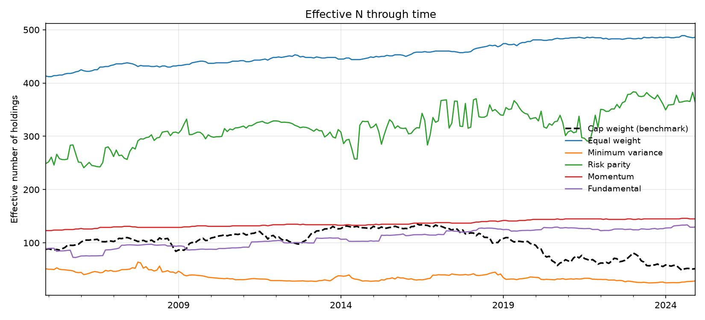
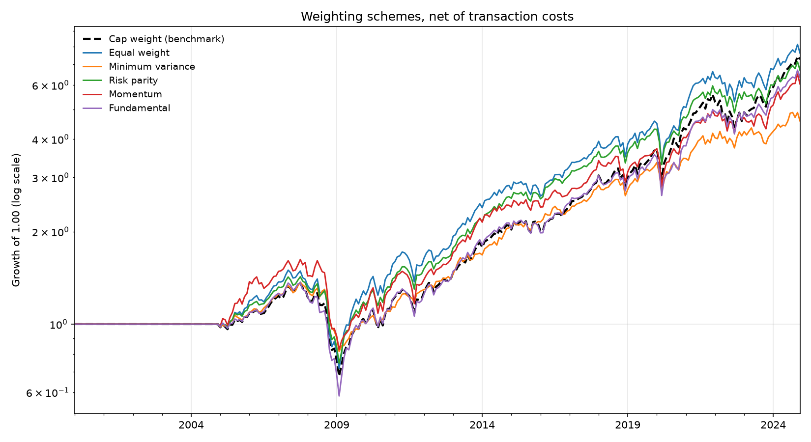

# S&P 500 Concentration Risk and Alternative Weighting

M.S. capstone research. Tests whether alternative weighting methodologies can restore diversification to the S&P 500 as market cap concentration has risen.

## Research Question

Cap-weighted index concentration has increased sharply, with the top ten names accounting for a growing share of total index weight. This raises a practical question for allocators: does a passive cap-weighted position still deliver the diversification it is assumed to provide, and can alternative weighting schemes recover it without giving up too much return?

The study evaluates six weighting methodologies against the cap-weighted benchmark over 2000 to 2025.

## Methodologies Tested

| Scheme | Construction |
|---|---|
| Cap weight (benchmark) | Float-adjusted market capitalization |
| Equal weight | 1/N across all constituents |
| Minimum variance | Quadratic optimization on a Ledoit-Wolf shrunk covariance matrix |
| Risk parity | Equal marginal risk contribution |
| Fundamental | Weights from accounting measures rather than price |
| Momentum | Trailing return ranking with a skip month |
| AI sentiment | FinBERT sentiment scored on SEC EDGAR filings |

## Data

All market data from CRSP monthly via WRDS. Fundamentals from Compustat
annual, linked to CRSP through CCM.

| Item | Source | Note |
|---|---|---|
| Returns | `crsp.msf` | Includes dividends |
| Delisting returns | `crsp.msedelist` | 23,654 merged. Omitting these is the classic survivorship bias in CRSP work |
| Market cap | `crsp.msf` | `abs(prc) * shrout` |
| Fundamentals | `comp.funda` | Revenue, book value, cash flow, dividends |
| Link | `crsp.ccmxpf_lnkhist` | GVKEY to PERMNO, date bounded |
| Membership | Project reconstruction | See below |

Everything is keyed on PERMNO, not ticker. Tickers are reused and reassigned
across companies; PERMNO is stable for the life of a security.

**No share code filter is applied.** The `shrcd IN (10, 11)` screen standard in
asset pricing work is wrong for index replication: it drops foreign
incorporated members (shrcd 12) and REITs (shrcd 18), roughly 50 of the 500.
Membership defines the universe, so the screen is redundant and biases the
result.

### Why membership is reconstructed

Two vendor sources were tested and both rejected:

- **`crsp.msp500list`** is not licensed under this institution's entitlement.
- **`comp.idxcst_his`, gvkeyx 000003** holds 503 open spells and **zero**
  recorded exits. It is a current member snapshot, not a history. Using it
  yields 218 constituents in 2005 and 462 in 2024, purely because departed
  members are absent. Nine candidate index codes were tested across three
  dates; none carries S&P 500 spell history. See `diagnose_history.py` and
  `find_index_code.py`.

Membership therefore comes from index change history walked backward from the
current constituent list, then mapped to PERMNO through `crsp.msenames` with
the name window enforced so a reused ticker resolves to the company that held
it on that date.

**Coverage: median 471 of about 503, or 93.6%.** The reconstruction itself
produces 501 to 512 per month; the shortfall is tickers with no CRSP name
record on the relevant date. Missing names skew toward smaller and
shorter-tenured constituents, so the benchmark's measured concentration is if
anything understated, which is conservative for the hypothesis under test.

## Validation

The reconstructed universe was validated against a WRDS reference series. Tracking difference against the benchmark was reduced across successive iterations to within a documented tolerance. Validation output is in `validation/`.

## Repository Layout

```
sp500-concentration-research/
|
|-- README.md
|-- LICENSE
|-- .gitignore
|-- requirements.txt
|
|-- src/
|   |-- __init__.py
|   |-- benchmark.py
|   |-- membership.py
|   |-- metrics.py
|   `-- weighting.py
|
|-- strategies/
|   |-- __init__.py
|   |-- fundamental_weight.py
|   |-- momentum_weight.py
|   |-- sentiment_weight.py
|   `-- variance_weight.py
|
|-- docs/
|   |-- methodology.md
|   `-- roadmap.md
|
|-- results/
|   `-- .gitkeep
|
|-- tests/
|   |-- __init__.py
|   |-- test_membership.py
|   `-- test_metrics.py
```

## Setup

```bash
python -m venv .venv
source .venv/bin/activate        # Windows: .venv\Scripts\activate
pip install -r requirements.txt
```

WRDS credentials are read from the environment and are never committed:

```bash
export WRDS_USERNAME=your_username
```

## Metrics Reported

Annualized return, volatility, Sharpe ratio, maximum drawdown, turnover, effective number of constituents, Herfindahl-Hirschman index of weights, and active share against the cap-weighted benchmark.

## Tests

```bash
python -m pytest tests -q
```

14 tests covering concentration metrics and point-in-time membership reconstruction.

## Results

Reproduce with `python run_results.py --membership reconstruction`. Full output
in [results/summary.md](results/summary.md).

**Sample 2000-01 to 2024-12**, 1,073 securities, median 471 constituents.
Monthly rebalance, 60-month trailing estimation window, 5 bps one-way costs.

| Scheme | CAGR | Vol | Sharpe | Max DD | IR | Effective N | Top 10 | Turnover |
|---|---|---|---|---|---|---|---|---|
| **Cap weight (benchmark)** | **8.26%** | **13.49%** | **0.613** | **-50.35%** | — | **100.6** | **23.54%** | 0.027 |
| Equal weight | 8.47% | 15.42% | 0.549 | -52.11% | 0.105 | 454.9 | 2.20% | 0.007 |
| Minimum variance | 6.28% | 10.33% | 0.608 | -40.37% | -0.309 | 35.8 | 41.32% | 0.110 |
| Risk parity | 7.91% | 13.17% | 0.601 | -47.68% | -0.102 | 317.8 | 8.59% | 0.029 |
| Momentum | 7.47% | 14.55% | 0.513 | -49.05% | -0.099 | 136.0 | 7.37% | 0.197 |
| Fundamental | 7.68% | 14.74% | 0.521 | -57.15% | -0.090 | 108.6 | 23.21% | 0.011 |





### No scheme improved risk-adjusted return

Cap weighting posted the highest Sharpe in the sample at 0.613. Minimum
variance effectively tied it at 0.608 and every other scheme fell short.
Information ratios are negative for five of six; equal weight's +0.105 is the
sole positive figure and is not distinguishable from zero over 25 years.

Equal weight did earn more in absolute terms, 8.47% against 8.26%, but paid
193 basis points of additional volatility for 21 basis points of additional
return and finished with a deeper drawdown. Diversification was available;
it was not compensated.

### Minimum variance is more concentrated than the index it replaces

This is the central finding, and it cuts against the premise the strategy is
usually sold on.

| | Effective N | Top 10 weight | Gini |
|---|---|---|---|
| Cap weight | 100.6 | 23.54% | 0.786 |
| Minimum variance | 35.8 | 41.32% | 0.959 |

Minimum variance holds roughly a third as many effective positions as the
benchmark, puts 41% of capital in ten names against the index's 24%, and
reaches a Gini of 0.959. It reduces *volatility*, from 13.49% to 10.33%, and it
reduces *drawdown*, from -50.35% to -40.37%. It does not reduce concentration.
It relocates concentration from mega-cap growth into low-volatility names,
which is a different exposure and a more concentrated one.

A portfolio adopted to address concentration risk that concentrates the book
further is a result worth stating plainly.

### What did restore diversification, and what it cost

Equal weight and risk parity did diversify by construction: effective N of 455
and 318 against the benchmark's 101, with top-10 weights of 2.2% and 8.6%. So
the mechanical answer to the research question is yes, alternative weighting
restores diversification.

The economic answer is that it did not pay over this sample. Both schemes
delivered lower Sharpe ratios than the benchmark. Restoring diversification and
improving risk-adjusted outcomes are separate questions, and only the first was
answered affirmatively.

### Other observations

**Fundamental weighting had the worst drawdown at -57.15%**, worse than the
cap-weighted index. Its value tilt loaded on financials going into 2008, which
is the mechanism by which a diversifying strategy can concentrate risk into a
single event.

**Momentum had the worst Sharpe at 0.513** and by far the highest turnover at
0.197 monthly, roughly 236% annualised. At 5 bps it pays about 24 bps a year;
it is the scheme most sensitive to the cost assumption.

**Concentration metrics are sample averages.** Cap weight's effective N of 100.6
is the mean across 2000 to 2024. The time series in the figure above is the
exhibit that speaks to the concentration question, since the level in 2024 is
far below the sample mean.

## Status

In development. Defense scheduled August 2026.

## License

MIT

---

*Academic research. Not investment advice.*
